## 0.前期准备工作

一台工作正常的 PVE 服务器， PVE 安装与配置方法参考我的系列文章《[Proxmox VE 折腾手记](https://gitee.com/callmer/pve_toss_notes)》。  

访问 RouterOS 的官网 [Mikrotik](https://mikrotik.com/download) 下载 Winbox 和 CHR 版本的固件，并一同下载固件的校验文件。


## 1.创建 RouterOS 的虚拟机

### 1.1.常规

登录到 PVE 后台后，进入新建虚拟机流程，并打开高级选项。  

节点即本机，`VM ID` 和 名称 可以自由定义。  


### 1.2.操作系统

操作系统类别选择 `Linux` 、内核版本 `5.x - 2.6 Kernel` 即可，且无需使用引导介质。


### 1.3.系统

系统部分需要修改一项内容，SCSI 控制器选择 `VirtIO SCSI single` 。

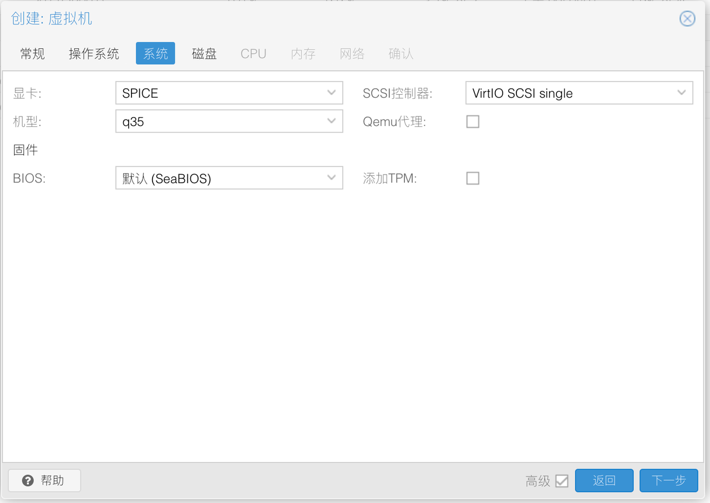

### 1.4.磁盘

磁盘部分，为了避免后续有多块磁盘，此处选择删掉所有的磁盘。

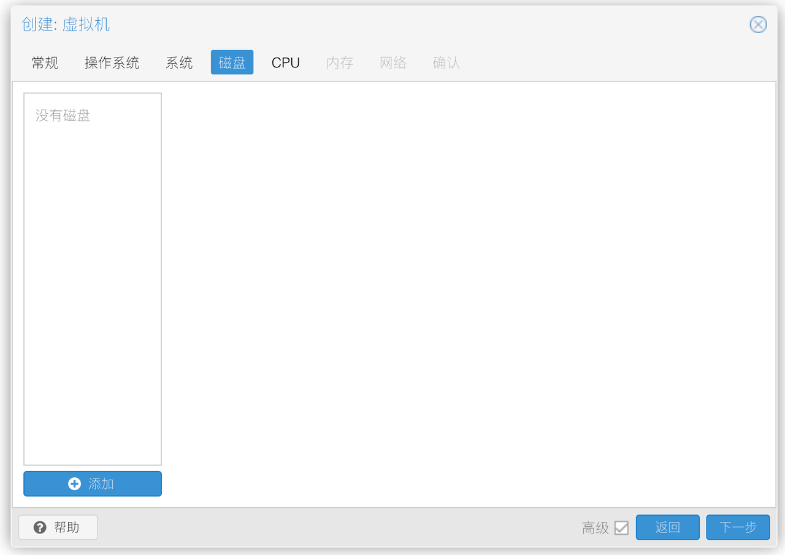

### 1.5.CPU

根据设备的 CPU 资源来定义 RouterOS 的 CPU 虚拟资源。  

CPU类别选择 `host` ，核心根据您物理 CPU 核心数进行酌情设置，推荐启用 **NUMA** 。  

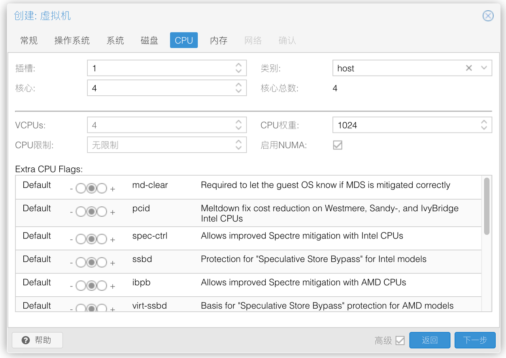

### 1.6.内存

内存一般 2G 足够使用，关闭 `Ballooning` 设备选项。

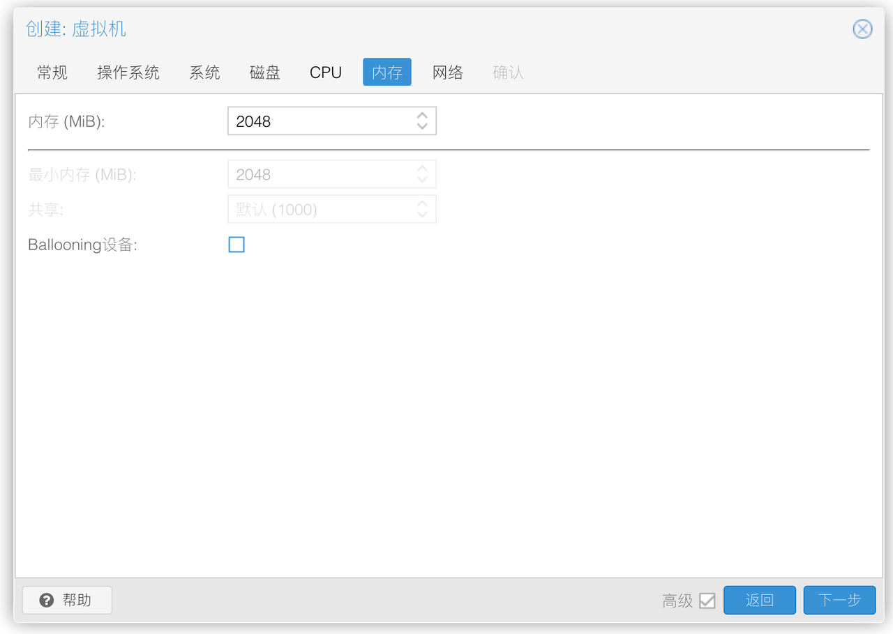

### 1.7.网络

网络处需要注意，此页设置只能添加一个网络设备，而网络设备的添加顺序将和 RouterOS 内部显示的网卡顺序一致。  

因此我们此处先仅添加 WAN 对应的网口（此处为 `vmbr0` ），模型选择 `VirtIO` ，并取消勾选防火墙选项。  

对于使用硬件直通的小伙伴，可以根据实际情况来修改此处网络设备选项。  

推荐在 **Multiqueue** 处根据前面设置的 CPU 数量进行网卡多队列设置，设置比例为 1:1 。  

即有 n 个 CPU 核心，此处多队列也设置为 n 。  

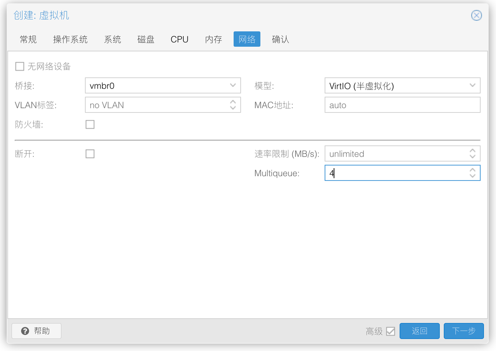

### 1.8.确认

接下来查看设置总览，确认无误，即可点击 “完成” 。

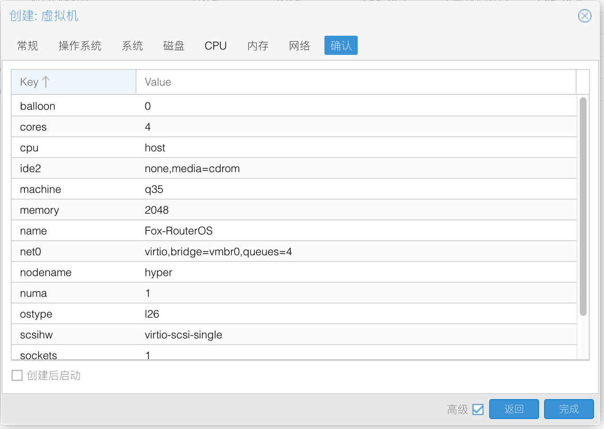


## 2.调整虚拟机硬件参数

此时，查看虚拟机详情页，可以看到我们刚才创建的虚拟机。  

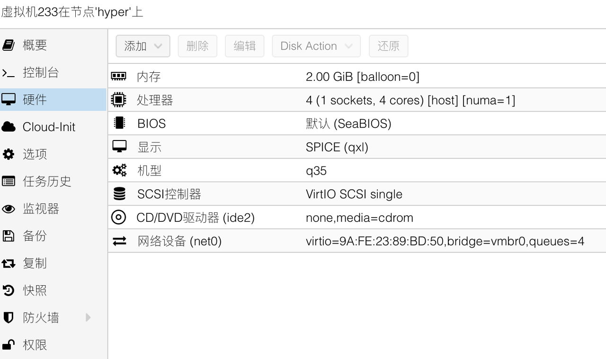

去掉 CD/DVD 驱动器后，开始添加需要的网络设备。  


按需添加需要的网络设备，并去掉防火墙，增加网卡多队列选项。示例如下：

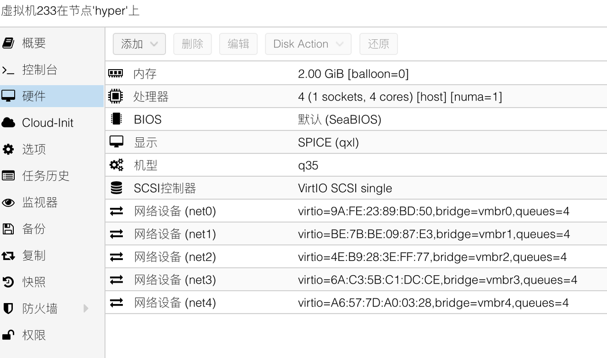


## 3.创建RouterOS硬盘

### 3.1.上传 RouterOS 镜像到 PVE

鉴于大家使用的操作系统有 Windows、macOS、Linux，因此大家使用的 SSH 工具可能不同。  

因此此处不演示如何使用 SFTP 工具。  

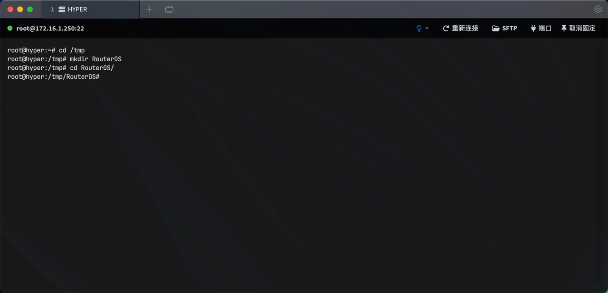

使用 SSH 工具登录到 PVE 服务器，并进入 tmp 目录，创建一个文件夹：

```bash
# 进入 tmp 目录
cd /tmp

# 创建文件夹
mkdir RouterOS

# 进入文件夹
cd RouterOS

```

将 RouterOS 固件上传到该文件夹中，并检查 `hash` ：

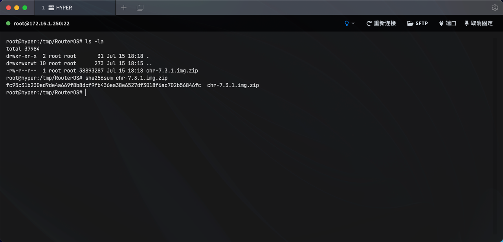

```bash
# 检查文件是否存在
ls -la

# 计算文件 hash
sha256sum chr-7.3.1.img.zip 

```

确认无误后，开始对镜像进行转换，并导入刚才创建的 RouterOS 虚拟机中。

### 3.2.镜像转换

由于上传的镜像为 Zip 压缩格式，因此需要首先对其解压缩。

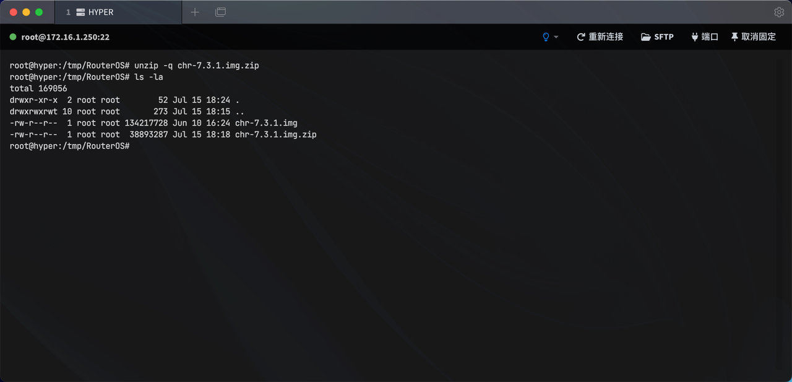

```bash
# 将固件解压缩
unzip -q chr-7.3.1.img.zip  

```

解压出 RouterOS 的 `img` 格式的镜像，然后使用 PVE 自带命令行工具，对其进行格式转换：

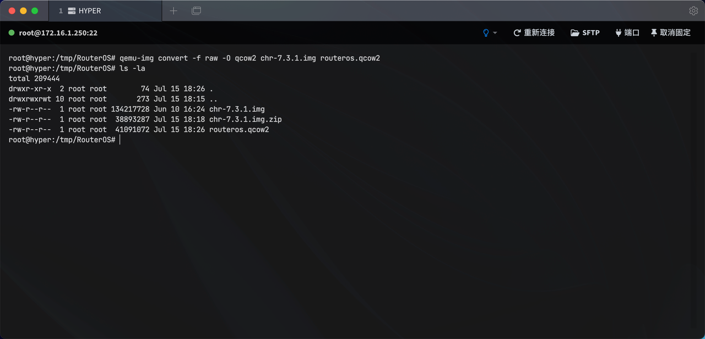

```bash
# 将 img 格式的镜像转换成 qcow2 格式
qemu-img convert -f raw -O qcow2 chr-7.3.1.img routeros.qcow2

```

得到了大家最为熟悉的 **qcow2** 格式的镜像。

### 3.3.镜像导入虚拟机

在创建 RouterOS 虚拟机时，曾指定了 `VM ID`，演示中为 **`233`** ；该编号后续会用到，大家在参考本文章时，需要注意替换。

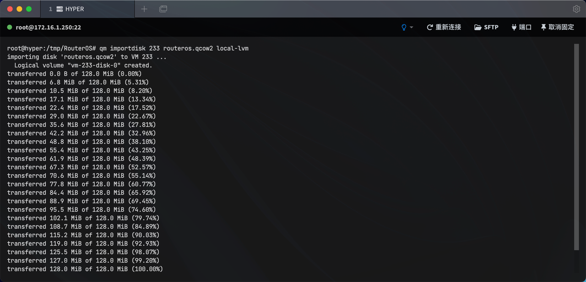

 **再次重申，命令中的 `233` 要替换成您自己的 RouterOS 虚拟机编号。** 

```bash
# 将 qcow2 镜像导入虚拟机中
qm importdisk 233 routeros.qcow2 local-lvm

# 输出结果为以下类似内容表示成功
Successfully imported disk as 'unused0:local-lvm:vm-233-disk-0'  

```

### 3.4.调整 RouterOS 虚拟机磁盘设置

在磁盘导入成功后，会发现虚拟机的硬件列表中多出了一块未使用的磁盘设备，鼠标双击该设备进行一些配置调整。

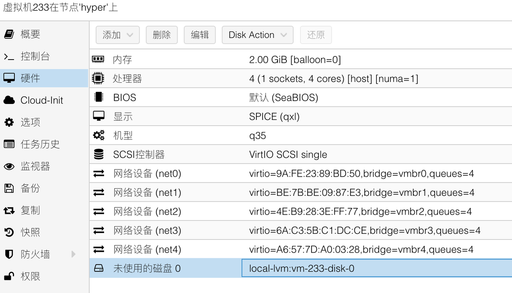

在弹出的对话框中，勾选 `IO thread` 选项，点击“添加”按钮。

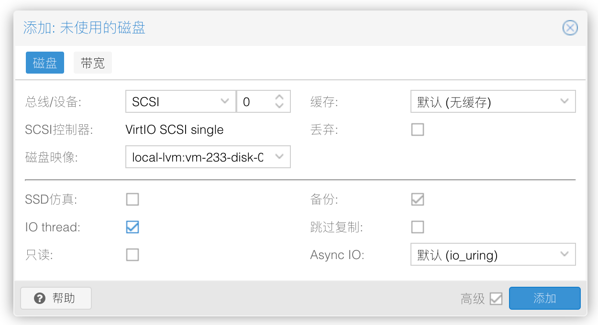

此时，磁盘大小为 128M ，为了方便后续使用，需要对该磁盘空间进行扩容。  

此处扩容后，在 RouterOS 虚拟机 **初次启动** 时，会根据磁盘空间自动扩容安装，所以无需担心。

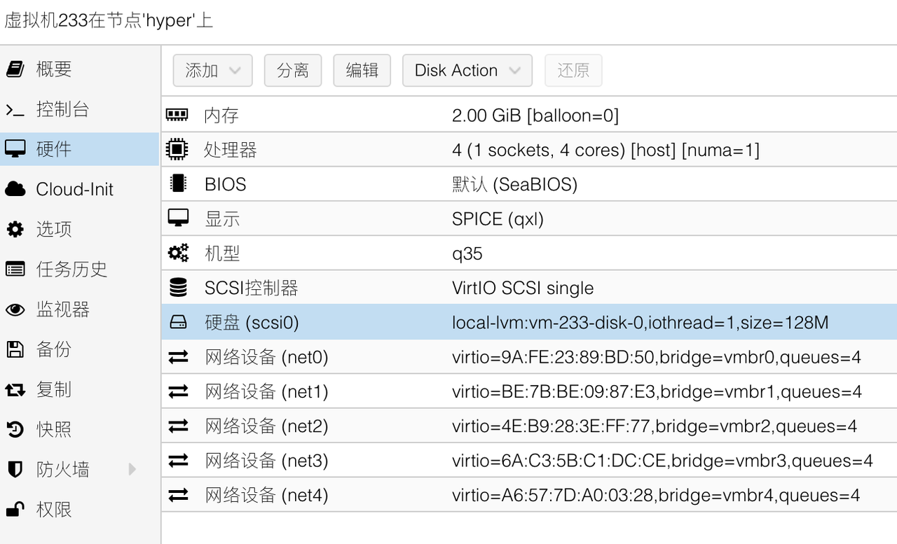

选中该磁盘，然后点击 `Disk Action` 的 `Resize` ：

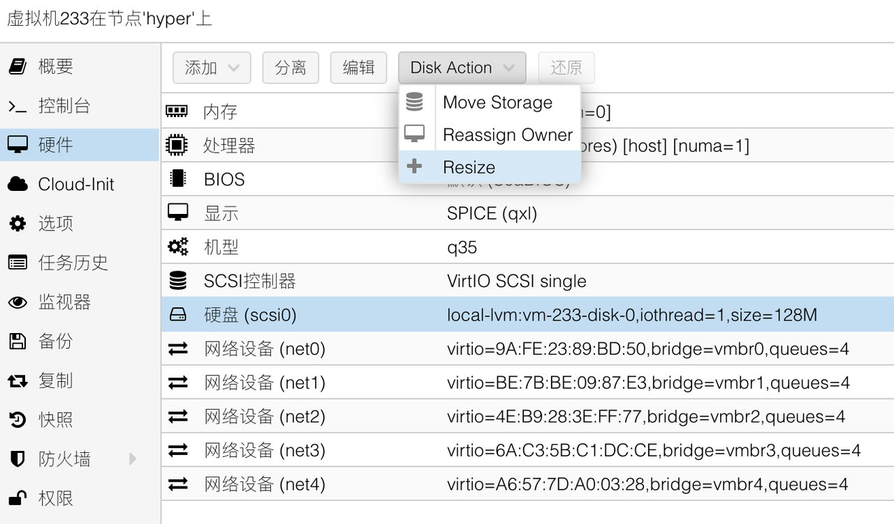

根据需要，扩容一定量的磁盘空间；我作为演示，仅增加 1G 的磁盘空间，并点击 “调整磁盘大小” ：

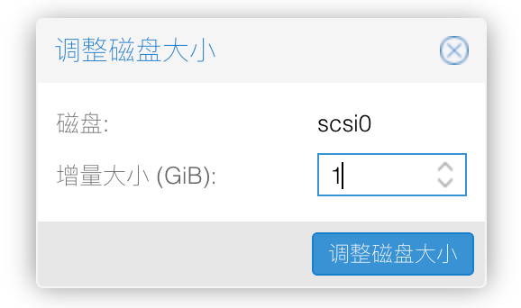

调整完成后，磁盘容量已被扩容。

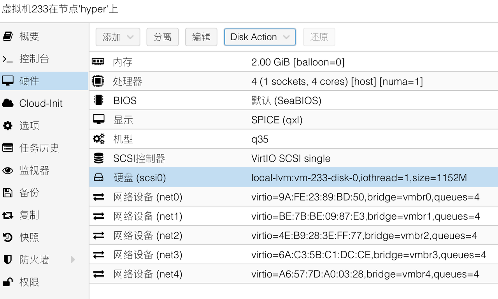


## 4.调整虚拟机配置参数

初创的 RouterOS 的配置参数如下：

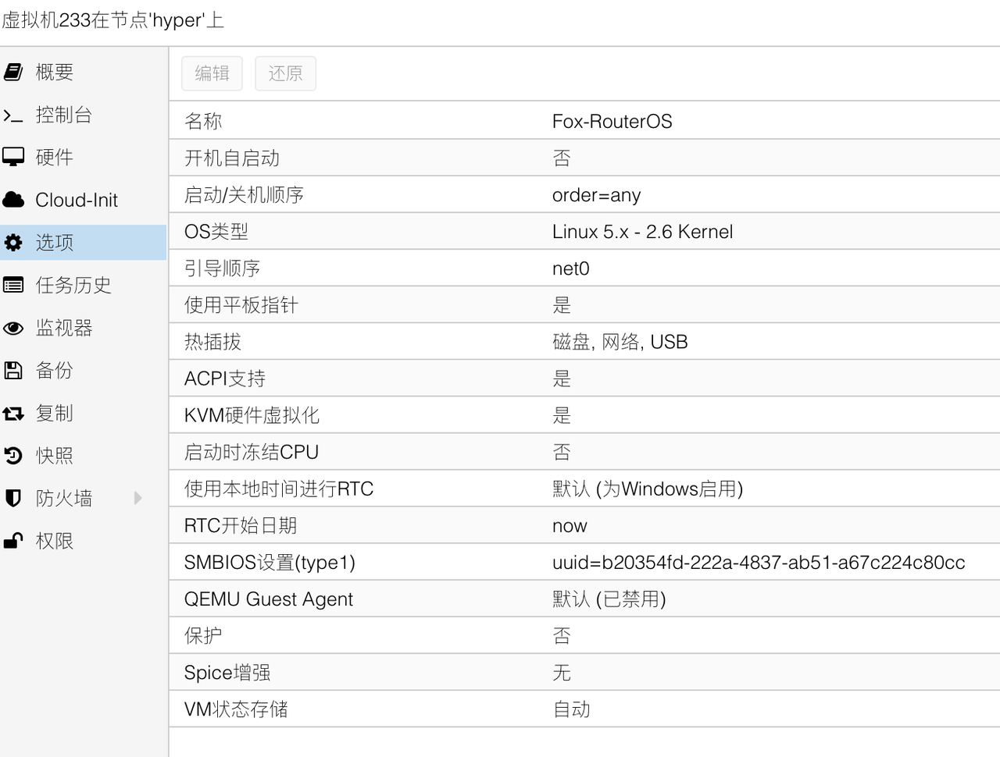

需要修改的部分有如下几个：  
1.  开机自启动（建议在 RouterOS 完全设置好之后再修改）
2.  启动/关机顺序（建议在 RouterOS 完全设置好之后再修改）
3.  引导顺序
4.  使用平板指针

### 4.1.设置开机自启动

开机自启动设置为 “是” 。  

启动顺序推荐如下：

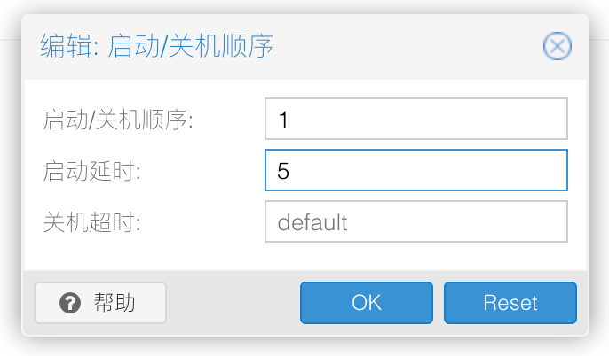

启动/关机顺序为 “1” ，表示该虚拟机第一个启动，最后一个关机。  

启动延时为 “5” ，表示该虚拟机在 PVE 启动完成后，延迟5秒自行启动。  

### 4.2.修改引导顺序

在 `scsi0` 设备处，勾选前面的 “已启用” 复选框，并使用行首的排序功能，将该设备拖拽到第一个。  

然后点击 `OK` 。  

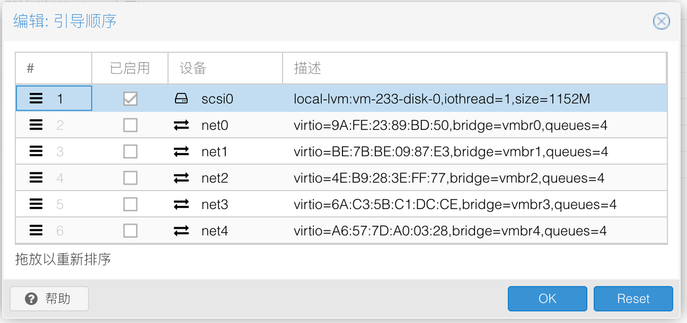

### 4.3.修改平板指针设置

关闭“使用平板指针”的选项，可以一定程度上降低虚拟机的 CPU 使用率。

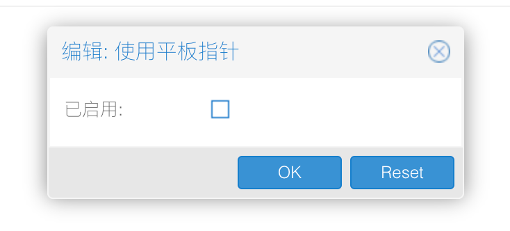

修改完成后，总体情况如下，等待 RouterOS 完全配置好，运行无异常之后，即可开启该虚拟机的 **“开机自启动”** 设置。  

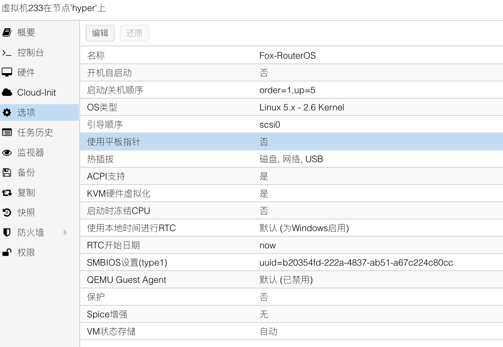


## 5.虚拟机开机

此时开始检验 RouterOS 虚拟机是否可以正常启动。  

切换到虚拟机的 “控制台” 选项卡，让虚拟机开机。  

此处需要注意的是，目前 RouterOS 并未设置，因此不会对网络造成什么影响，但是如果后续 RouterOS 配置了内部网络接口的桥接，且此时 PVE 有其他的路由系统（例如 Openwrt）也在相同的网络接口上有桥接，就会引起网络环路导致网络无法访问。  

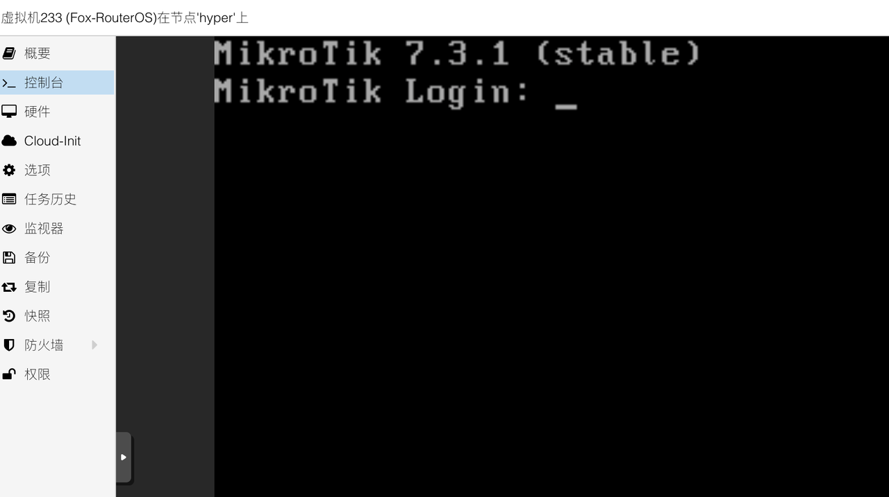

开机后，显示如图内容，即表示 RouterOS 已经安装成功。

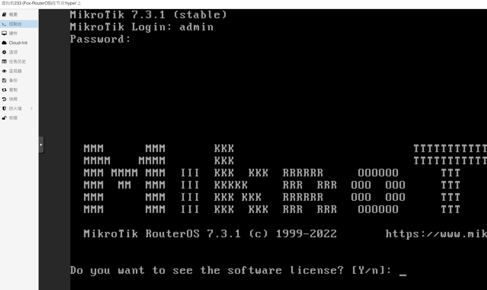

RouterOS 的默认账户为 **“admin”** ，密码 **为空** 。  

至此，RouterOS 虚拟机安装步骤完成。