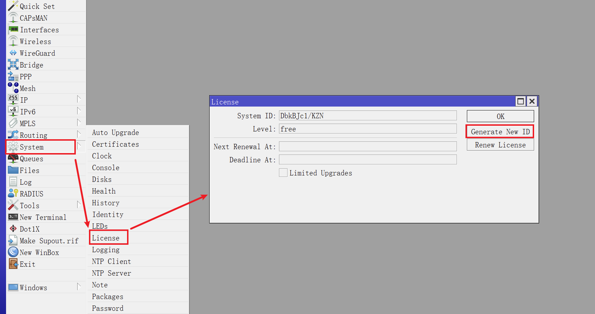
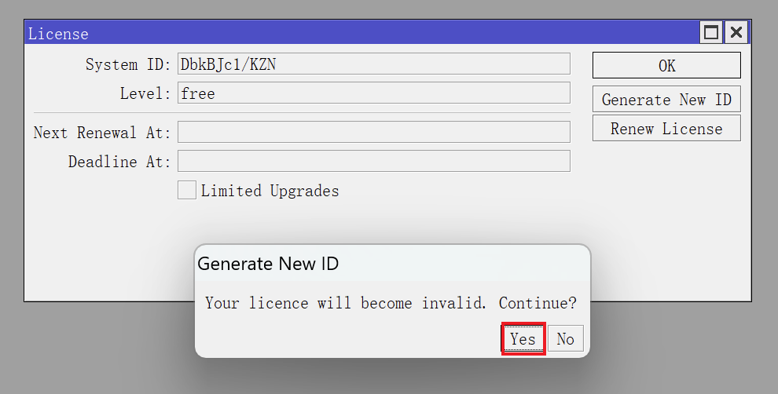
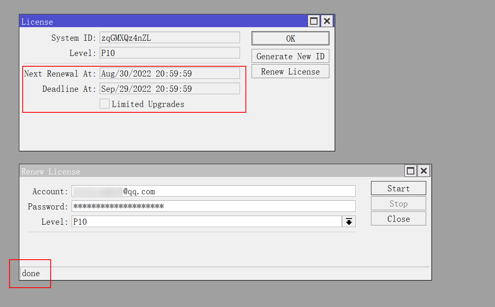
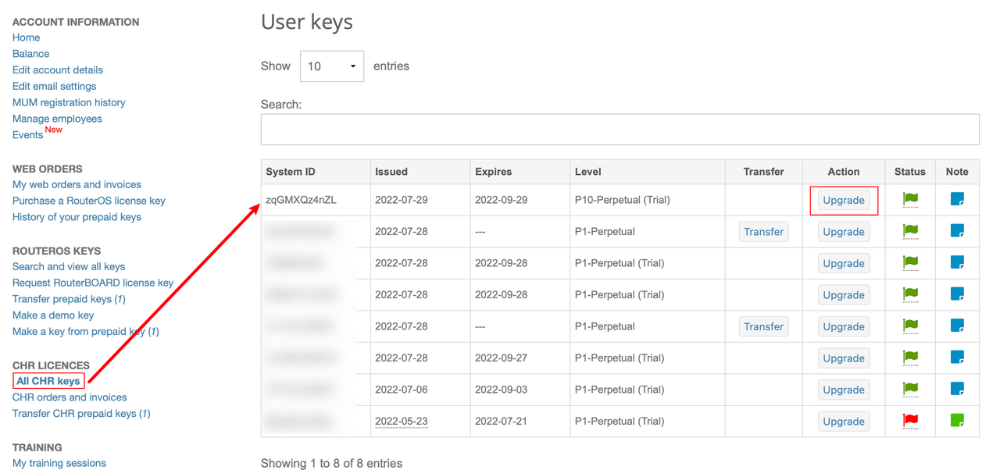
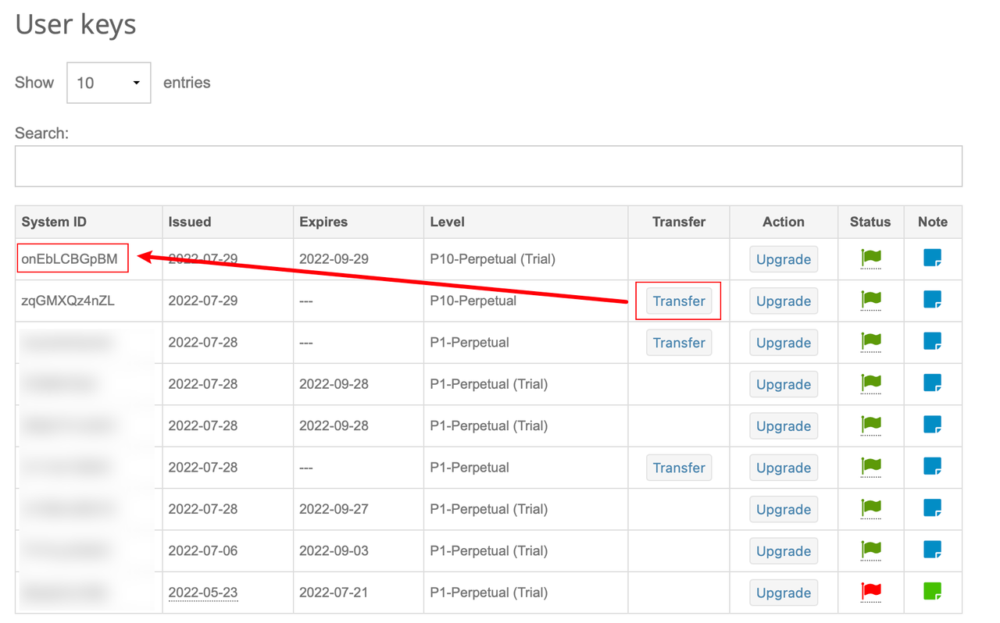
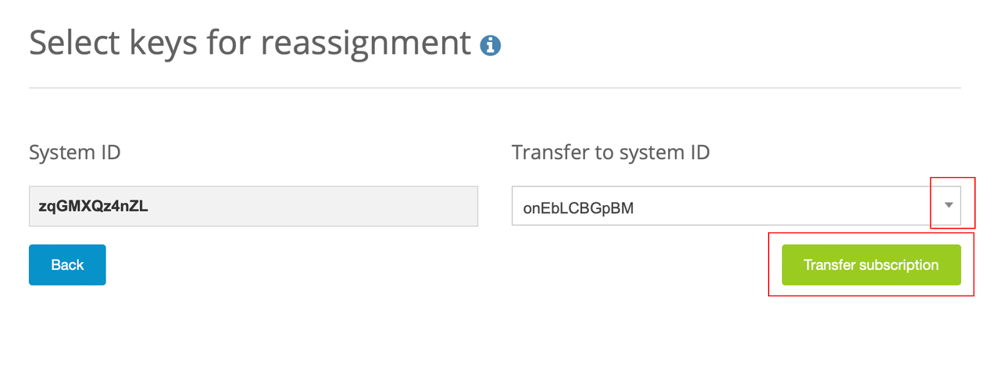
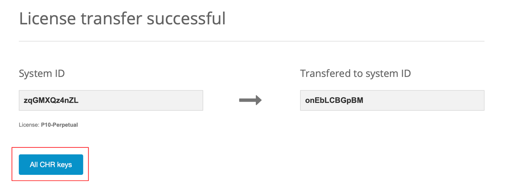

## 0.前景提要

在上一篇文章《[02.配置防火墙和流量整形](./02.配置防火墙和流量整形.md)》中，我们设置好了接口组、防火墙和流量整形。  

而有的小伙伴反馈在测速的过程中只能有 `1Mbps` 的带宽，那是因为 RouterOS 在 “试用” 状态下有默认的网口限速。  

本文将告诉大家如何激活正版 RouterOS 系统。

## 1.系统激活

### 1.1.购买 License

因为使用的是原装系统，不像其它 “克隆版” RouterOS 虚拟机镜像，导入后开机就是激活状态。  

我们需要使用 Mikrotik 官方 `License` 来激活我们的系统。  

首先我们需要用邮箱注册 Mikrotik 账号，注册地址为 `https://mikrotik.com/client` 。

然后使用某宝或其他渠道购买一个 `License` ，CHR 的 `License` 分为 P1、P10、PU 三个版本，其区别在于 “网口限速” 。  

对于有 2.5G 网口的设备，推荐购买 P10 授权。

- P1 版本：限速为 1Gbps ，物理接口为千兆设备使用
- P10 版本：限速为 10Gbps，物理接口为千兆以上万兆以下设备使用
- PU 版本：不限速，任意速度的物理接口均可使用

授权购买后，回到 Mikrotik 官网并登录账号，进入到账户中心。  

在 `Transfer prepaid keys` 页面会看到有一个新的 `License` 。  

**注意：只有这里显示出新购买的 `License` 才表示这个 `License` 真正属于你了。**  

### 1.2.更新 System ID

使用 Winbox 登录 RouterOS ，点击左侧导航 `System` 菜单的子菜单 `License` 。  

如果希望更换 `System ID`，或从 P1 升级到 P10 或更高级授权，可以点击 `Generate New ID` 来更新。  

系统会提示说明“旧授权将不再可用，是否确认”，点击 `yes` 即可：  

**注意：谨慎使用 `System ID` 更新功能，超过一定次数后该功能将不可用，只能重装系统。**  

更新 `System ID` 后，接下来需要更新 `License` 授权信息。  

点击 `Renew License` ，输入 Mikrotik 的账户和密码，并选择对应的授权级别（演示为 P10 授权），点击 `Start` ： 

当下方提示显示为 `done` ，则表示 `License` 信息更新成功， `License` 对话框将显示授权的自动校验时间：

### 1.3.激活系统

此时回到 Mikrotik 的账户中心，在 `All CHR Keys` 页面，会出现刚刚刷新了 `License` 授权信息的 `System ID` 。  

接下来我们要对其更新授权，点击右侧 `Upgrade` ：

进入授权升级页面，左下角可以看到已付费 `License` 信息。  

根据使用需求，选择授权级别 `Level` （演示中为 P10 授权），并点击 `Upgrade` ：

点击 `Pay using Prepaid key` ，即可完成授权：

此时回到 `All CHR keys` 页面，可以看到系统的授权信息已经变更：

### 1.4.授权转移

由于虚拟机可能被重装，CHR 版本 RouterOS 的授权 `License` 是可以在不同虚拟机之间转移的。  

当重装了 RouterOS，或者通过前面步骤更新了 `System ID` 后，可在 Mikrotik 的账户中心中对授权进行转移。  

在 Mikrotik 账户中心的 `All CHR Keys` 页面，记住新系统的 `System ID` ，然后点击需要转移的授权的 `Transfer` ：

通过右侧下拉列表找到新系统的 `System ID` ，然后点击 `Transfer subscription` ，即可授权转移：  

授权转移完成：  

回到 `All CHR keys` 页面，可以看到新系统已被正确授权，而老系统的授权已经失效：

至此，系统已经激活完成，可以通过带宽测速来检验授权是否成功，后续将对 RouterOS 的系统服务、系统账户等内容进行调整。  
