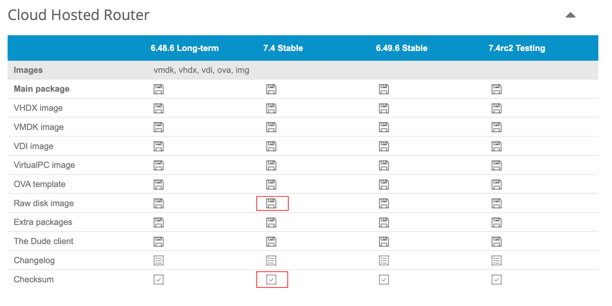
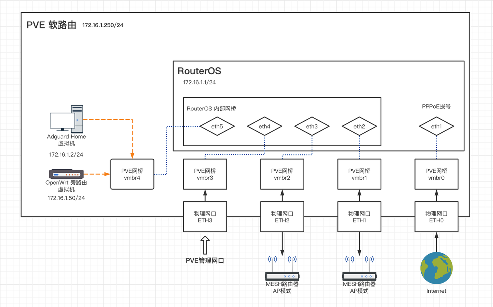
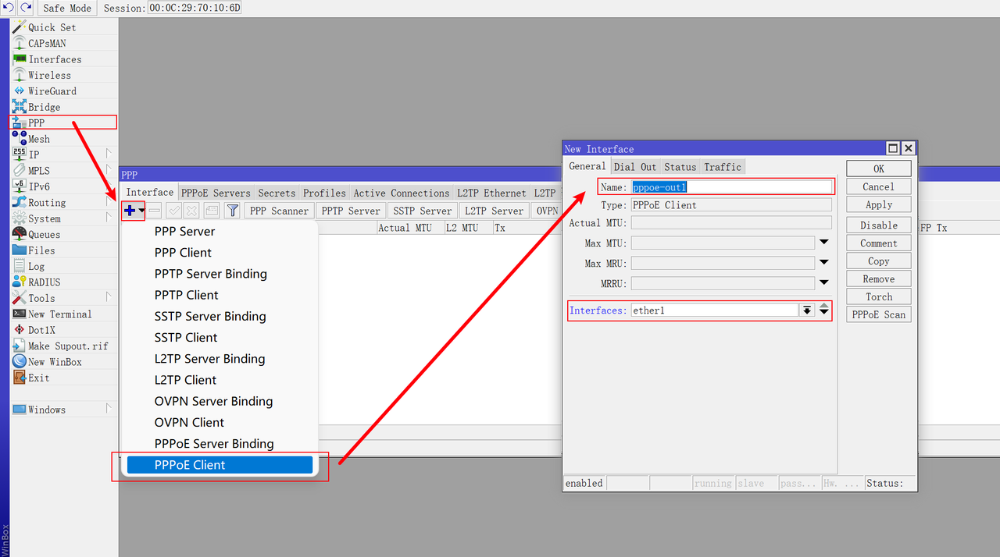
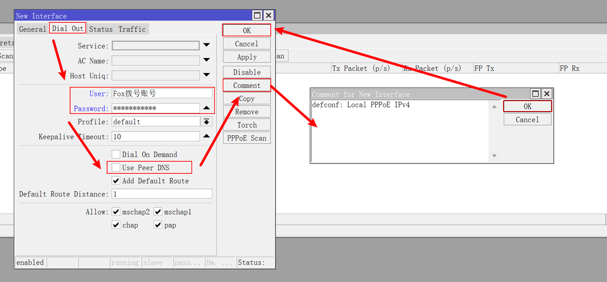

## 0.前景提要

在上一篇教程中，我们已经在 PVE 环境下安装好了 RouterOS，但是由于我咕的太久，现在 RouterOS 已经更新到了 7.4 Stable 版本。  

为了保证教程的及时性，我决定重装 RouterOS。  

到 [Mikrotik](https://mikrotik.com/download) 的官方网站下载最新的 Winbox 软件、RouterOS 固件以及固件对应的校验信息。  

### Winbox:


### RouterOS 固件:



### RouterOS 固件校验信息：


 **_说明：_**   

 _本系列教程适用于 CHR 版本和 MikroTik 原厂硬路由的 RouterOS 配置。_   

 _对于原厂硬路由，RouterOS 自带的“Quick Set”可以减少配置步骤，但自动配置出来的内容较为简单，且仍需调整参数。_   

 _这里推荐 2 款 MikroTik 的硬件设备，普通家庭上网环境可以使用被誉为弱电箱神器的 `hex` 系列 `RB750Gr3` ，对性能有较高要求事可以使用 `RB5009UG+S+IN` 。_  


## 1.备注网口

由于 Winbox 目前只支持 Windows 设备，因此在 macOS 或 Linux 环境下时，需要准备一个 Windows 的虚拟机或者使用 `Wine` 。  

  

打开 Winbox ，并将 Windows 设备的 LAN 口与 PVE 软路由的 ETH1 到 ETH3 中的一个物理网口相连。此时 Winbox 会识别到一个新的 RouterOS 设备，并显示出该设备的 mac 地址，该设备的 IP 地址为 `0.0.0.0` 。

  

点击 mac 地址来登录 RouterOS。默认账户：admin，默认密码为空。登录系统后显示：


该对话框表示该系统未被授权。对于未被授权的设备将处于“试用”状态，RouterOS 的试用时长为24小时，且带宽被限制在 1Mbps 。  

点击“OK”关闭该窗口，点击左侧导航的“Interfaces”：


如果在 PVE 下安装 RouterOS 并添加网口过程中没有出现问题，此处应该显示5个网口。  

鼠标双击每个网口，并根据表格中的内容，对每个网口进行备注：

| 网口名称   | PVE网桥编号 | 物理网口 | 作用       | 备注                            |
|-------|---------|------|----------|-------------------------------|
| ether1 | vmbr0   | ETH0 | PPPoE 拨号 | `defconf: Local WAN`           |
| ether2 | vmbr1   | ETH1 | 内部网桥成员   | `defconf: Local LAN1`           |
| ether3 | vmbr2   | ETH2 | 内部网桥成员   | `defconf: Local LAN2`           |
| ether4 | vmbr3   | ETH3 | 内部网桥成员   | `defconf: Local LAN3`           |
| ether5 | vmbr4   | 无    | 内部网桥成员   | `defconf: Local LAN for Guests` |


备注完成后如图所示：


## 2.创建内部网桥

点击左侧导航的“Bridge”，点击“添加”按钮：


|参数|值|
|--|--|
|Name|`bridge1`|
|Comment|`defconf: Local Bridge`|

网桥创建完成后，给该网桥添加成员网口，切换到“Ports”选项卡，点击添加按钮：


从“Interface”下拉列表中选中需要添加的网口，点击“OK”，即可把网口添加为网桥成员接口。  

重复该操作，将所有 LAN 口都添加入该网桥。  

当然，除了使用 Winbox 来添加网桥以及成员接口的方法外，还可以 SSH 登录到 RouterOS，使用 CLI 来创建网桥并添加成员接口：

```bash
/interface bridge
add comment="defconf: Local Bridge" name=bridge1

/interface bridge port
add bridge=bridge1 interface=ether2
add bridge=bridge1 interface=ether3
add bridge=bridge1 interface=ether4
add bridge=bridge1 interface=ether5
```


## 3.创建 PPPoE 拨号

演示环境为使用 RouterOS 拨号上网，如果使用光猫拨号，可以跳过本段。  

点击左侧导航的“PPP”，点击“添加”按钮，选择“PPPoE Client”：  



| 参数        | 值           |
|------------|--------------|
| Name       | `pppoe-out1` |
| Interfaces | `ether1`     |

切换到“Dial Out”选项卡，填写 PPPoE 拨号需要的用户名和密码，并填写一个备注：



| 参数                | 值                           |
|-------------------|-----------------------------|
| User              | 拨号账户                        |
| Password          | 拨号密码                        |
| Use Peer DNS      | 不勾选                         |
| Add Default Route |  **必须勾选**                         |
| Comment           | `defconf: Local PPPoE IPv4` |
