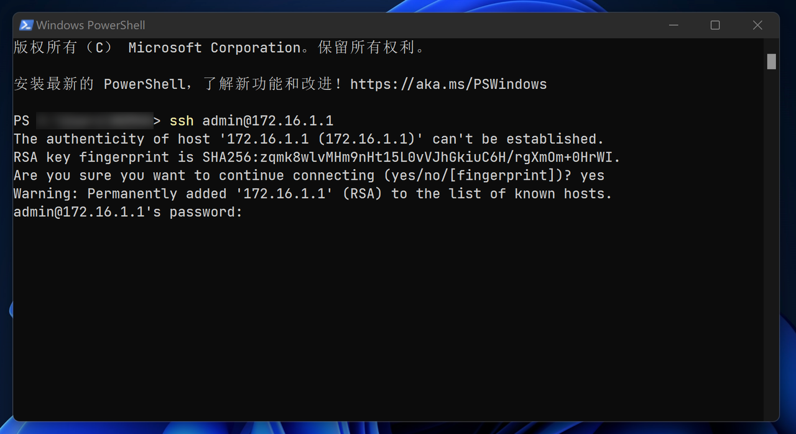
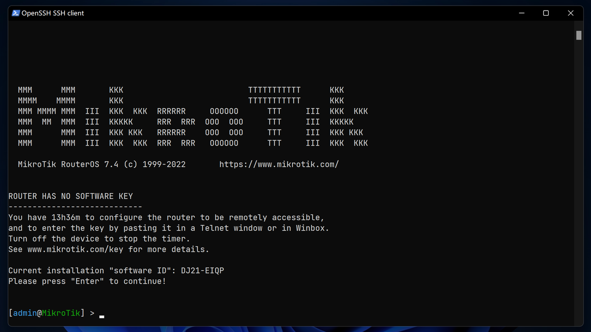

## 0.前景提要

在上一篇教程《[1.定义网络接口和基础配置](./1.定义网络接口和基础配置.md)》中，我们已经配置好了 RouterOS 的网络接口、DHCP、DNS等内容；  

此时，连接上 RouterOS 的设备可以正常获取到 IPv4 地址，但还不能正常访问外网。  

因为此时的 RouterOS 不仅关闭了 PPPoE 连接，而且还没有配置必要的防火墙设置。

## 1.工具准备

防火墙和流量整形的配置较为复杂，推荐使用 SSH 工具在 RouterOS 的命令行环境下进行配置。  

我目前常用的 SSH 工具是 [Tabby](https://github.com/Eugeny/tabby)，是一个基于 Electron 开发的开源跨平台终端工具，可以在 Github 平台上进行下载。


如果因为网络环境原因无法下载该软件时， Windows 系统自带的终端工具 `PowerShell` 也能一用。  

只需要在系统自带搜索中搜索“PowerShell”即可：


打开一个终端工具，输入以下命令：



```bash
## SSH 连接 RouterOS
ssh admin@172.16.1.1

## 询问是否保存秘钥
yes
```

然后输入 RouterOS 的密码进行登录。  

输入密码时不会有输入内容的提示，密码输入完后直接回车即可。登录成功后如图所示：



