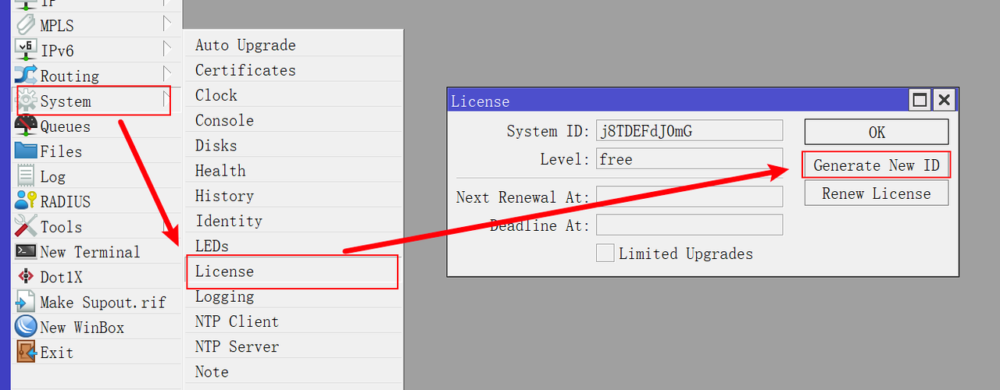
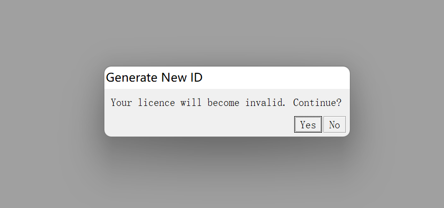
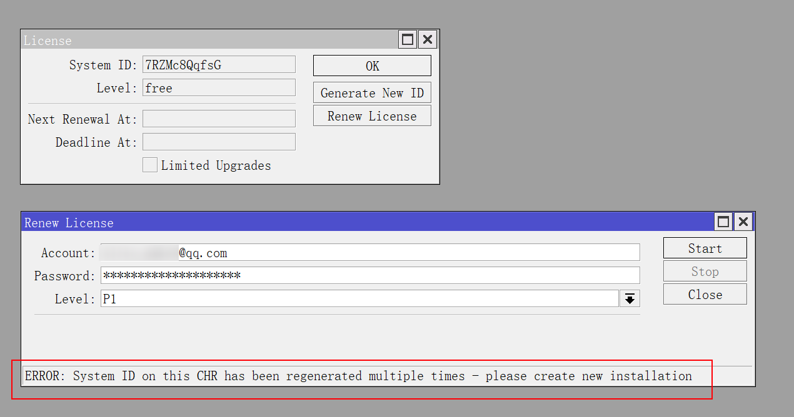

## 0.前景提要

在上一篇教程《[2.配置防火墙和流量整形](./2.配置防火墙和流量整形.md)》中，我们设置好了接口组、防火墙和流量整形。  

而有的小伙伴反馈在测速的过程中只能有 `1Mbps` 的带宽，那是应为 RouterOS 在“试用”状态下有默认的端口限速，本篇教程将告诉大家如何激活正版 RouterOS 系统。

## 1.系统激活

### 1.1.购买 License

因为本教程使用的是原装系统，不像其他直接导入虚拟机后开机就是激活状态的镜像 RouterOS，我们需要使用 Mikrotik 官方 `License` 来激活我们的系统。  

首先我们需要用邮箱注册 Mikrotik 账号，注册地址为 `https://mikrotik.com/client` 。

然后使用某宝或其他渠道购买一个 `License` ，CHR 的 `License` 分为 P1、P10、PU 三个版本，其区别在于“速度限制”，对于有 2.5G 网口的设备，推荐购买 P10 授权。

- P1 版本：限速为 1Gbps ，物理接口为千兆设备使用
- P10 版本：限速为 10Gbps，物理接口为千兆以上万兆以下设备使用
- PU 版本：不限速，任意速度的物理接口均可使用

授权购买后，回到 Mikrotik 官网并登录账号，进入到账户中心。在 `Transfer prepaid keys` 页面会看到有一个新的 `License` ，只有这里显示出新购买的 `License` 才表示这个 `License` 真正属于你了。

### 1.2.更新 System ID

打开 Winbox 并登录 RouterOS，点击左侧导航 `System` 菜单的子菜单 `License` 。  

如果希望更换 `System ID`，或从 P1 升级到 P10 及更高的授权，可以点击 `Generate New ID` 按钮来更新，系统会提示说明“旧授权将不再可用，是否确认”，点击 `yes` 即可：

 **注意：**   

 **需要谨慎使用 `System ID` 更新功能，超过一定次数后该功能将不再可用，只能重装系统。**  

有了 `System ID` 后，接下来需要刷新 `License` 授权信息。点击 `Renew License` 按钮，输入 Mikrotik 的账户和密码，并选择对应的授权级别（演示中选择了 P10 ），点击 `Start` 按钮： 

当下方提示显示为 `done` ，则表示 `License` 信息更新成功， `License` 对话框将显示授权的自动校验时间：

