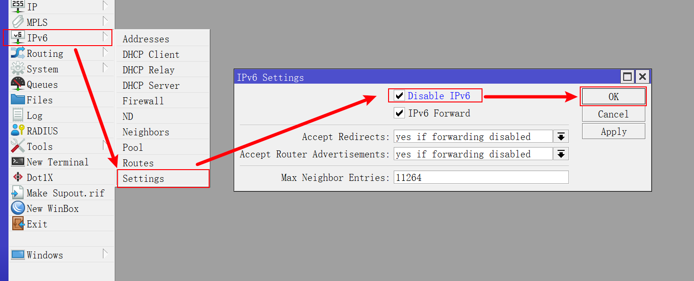

## 0.前景提要

在上一篇教程《[3.RouterOS正版系统激活](./3.RouterOS正版系统激活.md)》中，我们激活了正版 RouterOS 系统。接下来需要对 RouterOS 的一些系统参数进行调整。

## 1.关闭 IPv6

由于我目前没有使用 IPv6 网络，因此需要关闭 RouterOS 有关 `IPv6` 的功能。  

打开 Winbox 并点击左侧导航 IPv6 菜单的子菜单 Settings，勾选 `Disable IPv6` ：

## 2.调整系统服务

RouterOS 默认开启了 `api` 、`ftp` 等系统服务，这些服务日常使用中并不会用到，可以选择关闭。  

对于日常会使用到的系统服务，比如 `ssh` 、 `winbox` 等，需要限制可访问的 `IP` 地址段。  

点击左侧导航 IP 菜单的子菜单 `Settings` ，进入 RouterOS 系统服务管理界面。  

鼠标 **单击** 选中需要关闭的服务，点击 `Disable` 按钮，即可关闭服务：

在之前的 RouterOS 设置中我们规划了内网的网段为 `172.16.1.0/24` ，因此系统服务的 “可访问来源地址” 设置为与内网网段相同的网段。  

鼠标 **双击** 某项服务，进入该服务的配置界面，在 `Available From` 处填写 `172.16.1.0/24` 即可：  

RouterOS 系统服务的 “可访问来源地址” 和 “服务端口” 设置完成后，如下图所示：

## 3.设置时区 NTP

点击左侧导航 `System` 菜单的子菜单 `Clock` ，进入 RouterOS 系统时间管理界面。  

确保 `Time Zone Autodetect` 为勾选状态，`Time Zone Name` 为 `Asia/Shanghai` ：  

点击左侧导航 `System` 菜单的子菜单 `NTP Client` ，进入 RouterOS 系统 NTP 管理界面。  

勾选 `Enabled` ，在 `NTP Servers` 处填写国内常用 NTP 服务器地址 `ntp.tencent.com` 和 `ntp.aliyun.com` 。

