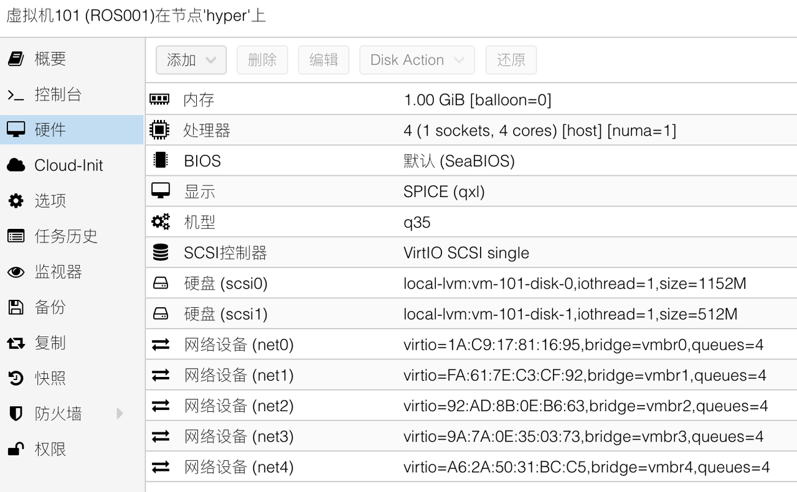
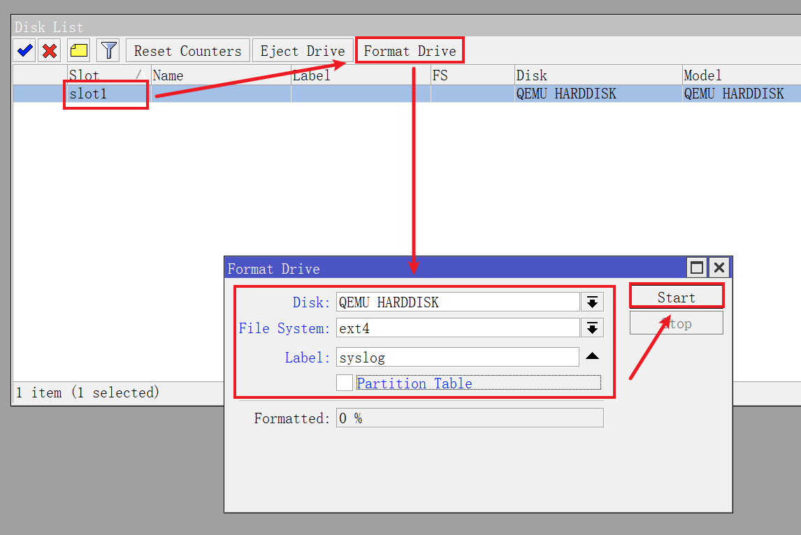

## 1.创建RouterOS日志硬盘

我们知道 RouterOS 的日志都在内存中，当系统重启后历史日志记录将会丢失。  

而使用附加硬盘来记录 RouterOS 的日志后，可以在系统意外重启时候看到历史日志信息，方便追溯问题。  

登录 PVE 的 WEB 管理后台，进入 RouterOS 虚拟机 `硬件` 配置界面。  

点击顶部 `添加` 按钮，选择 `硬盘` ：

 

`总线/设备` 选择 `SCSI` ，设备编号 PVE 会自动设置，演示中为 `1` 。  

`磁盘大小` 根据 PVE 服务器资源剩余情况酌情设置，演示为 `0.5` GiB。  

勾选底部 `高级` 选项，并勾选 `IO thread` ：

日志硬盘添加完成后，如图所示：

## 2.RouterOS格式化硬盘

打开 Winbox ，使用具有管理员权限的账号进行登录。  

点击 Winbox 左侧导航 `System` 菜单的子菜单 `Disks` ，查看当前硬盘列表：

鼠标 **单击** 选中新加入的磁盘，点击 `Format Drive` 按钮，对磁盘进行格式化操作。  

|参数|值|说明|
|--|--|--|
|Disk|`QEMU HARDDISK`|无需修改|
|File System|`ext4`|磁盘的文件系统，可选 `ext4` 和 `fat32` ，建议 `ext4`|
|Label|`syslog`|磁盘的标签，可用英文自由定义|

等待磁盘格式化完成后，可修改磁盘的名称，便于后续使用。  

鼠标 **双击** 分区条目 `slot-part1` ，进入磁盘编辑界面，修改 `Name` 并添加 `Comment` 备注信息：

|参数|值|说明|
|--|--|--|
|Name|`log`|磁盘名称|
|Comment|`defconf: System Log Disk`|备注信息|

