## 0.前景提要

在之前的文章的，RouterOS 已经可以使用 IPv4 网络正常上网。  

在 RouterOS v7.4 到 v7.5 这几个版本中，Mikrotik 官方对 IPv6 相关功能做了许多优化，是时候来配置 IPv6 网络了。  

根据 Mikrotik 官方文档，目前 RouterOS 能比较好的支持以 `SLAAC` 方式来配置 IPv6 ，而 DHCPv6 暂时只支持通告前缀信息，而不能分发地址。  

而且经过我的测试，如果把公网 IPv6 前缀信息通告到内网设备（即让内网设备直接具有公网 IPv6 地址），当 PPPoE 重新拨号或其他原因导致该公网 IPv6 前缀发生变化时，内网设备虽然也能同步获取新的公网 IPv6 地址，但此时 RouterOS 的 IPv6 路由表已经自动刷新，导致新旧公网 IPv6 地址并存的内网设备无法通过 IPv6 正常上网，只能通过重启该内网设备的网卡，让该内网设备刷新公网 IPv6 地址（等价于去掉旧的公网 IPv6 地址），才能恢复 IPv6 的网络访问。  

根据抓取 RouterOS 和 OpenWrt 的 `ICMPv6` 相关包可以发现，RouterOS 的 `Neighbor Discovery` 功能目前不支持通告 `ICMPv6 Option` 为 `Type: Route Information (24)` 的信息。而且 OpenWrt 在公网 IPv6 前缀发生变化时，除了会通告新的 IPv6 路由信息外，也会在系统 IPv6 路由表中新增路由条目，而旧的 IPv6 条目并不会删除，直到 OpenWrt 系统重启。  

总体而言， OpenWrt 对 IPv6 的支持就目前来说是好于 RouterOS 的，毕竟现在 OpenWrt 对 DHCPv6 也有良好的支持。  

鉴于以上种种约束条件的限制，本文章中的设置内容主要以 `SLAAC` 模式来分配 IPv6 地址，并加入了 `NAT66` 的防火墙，内网设备均使用 `ULA (Unique Local IPv6 Unicast Addresses)` IPv6 地址，通过地址转换来访问 IPv6 网络。

## 1.获取IPv6前缀

在之前的文章《[4.系统参数调整](./4.系统参数调整.md)》中，我们曾关闭了 IPv6 相关功能，此时需要将其打开。  

打开 Winbox 并点击左侧导航 `IPv6` 菜单的子菜单 `Settings` 。  

取消勾选 `Disable IPv6` ，并将 `Max Neighbor Entries` 参数（相当于 ARP 表最大条目数）修改为合适的数值，演示为 `1024` ：

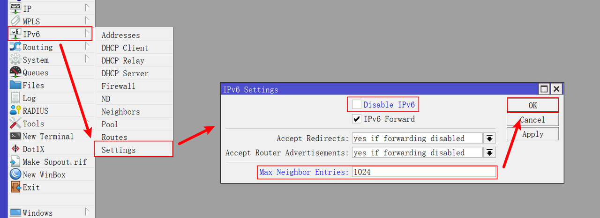

点击左侧导航 `IPv6` 菜单的子菜单 `DHCP Client` ，点击“添加”按钮：

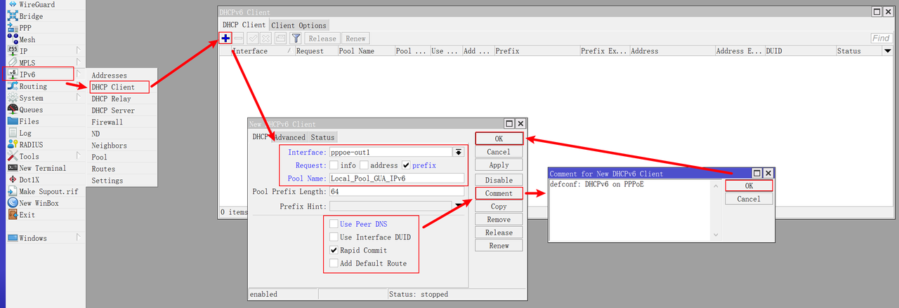

|参数|值|说明|
|--|--|--|
|Interface|`pppoe-out1`|从 PPPoE 拨号中获取 IPv6 前缀|
|Request|`prefix`|表示只获取前缀信息|
|Pool Name|`Local_Pool_GUA_IPv6`|设置 IPv6 地址池名称|
|Use Peer DNS| **取消勾选** |不使用运营商的 IPv6 DNS|
|Add Default Route| **取消勾选** |是否加入默认路由，建议是无需勾选|
|Comment|`defconf: DHCPv6 on PPPoE`|备注信息|

 **说明：**  
 **对于 `Add Default Route` 参数，官方建议是无需勾选。**   
 **也没有相关的 RFC 文档说明 `DHCPv6 Client` 需要添加默认路由，此处存在该设置应该是 RouterOS 独特的 “快捷设置” 方法。**   
 **经过测试，该选项勾选与否均不影响后续的设置以及 IPv6 的网络访问；同时也无法解决公网 IPv6 前缀变化后，内网设备具有旧公网 IPv6 地址而无法上网的问题。**   

`DHCPv6 Client` 创建完成后，如果正确获取到了 IPv6 前缀信息，将如图所示：

如果未获取到前缀信息，需要让 PPPoE 重新拨号。  

如果重新拨号后，仍未获取 IPv6 的前缀信息，那么可能运营商并未提供 IPv6 接入的能力。  

## 2.设置接口IPv6地址

在给内部接口设置公网 IPv6 地址时，拨号的接口 `pppoe-out1` 是 **无需** 分配公网 IPv6 地址的。  

只需要给内网的网桥接口 `bridge1` 分配一个公网 IPv6 地址，并附加一个私有 ULA IPv6 地址即可。  

 **说明：**   
 **当前 RouterOS IPv6 还未设置防火墙，给内部接口分配公网 IPv6 之后，RouterOS 相当于已经与公网互联。**   
 **如果当前 RouterOS 有不完善的安全设置（比如使用了弱登录密码），系统存在被入侵的风险。**   
 **因此建议先关闭 `DHCPv6 Client` ，直到 RouterOS IPv6 防火墙等内容设置完成后，再将其打开。**   

### 2.1.给网桥接口分配公网IPv6地址

点击 Winbox 左侧导航 `IPv6` 菜单的子菜单 `Addresses` ，点击“添加”按钮：

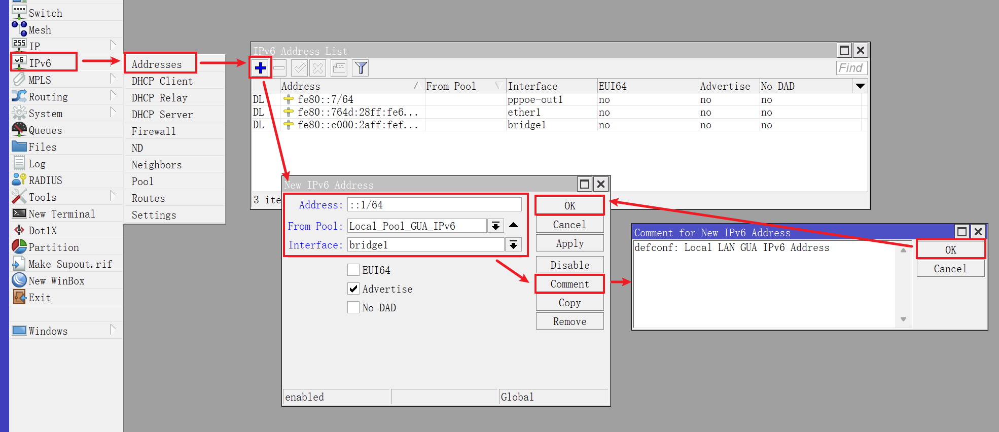

|参数|值|说明|
|--|--|--|
|Address|`::1/64`|自动匹配前缀，前缀长度为 `/64` ，并使用顺序第一个地址|
|From Pool|`Local_Pool_GUA_IPv6`|选择 `DHCPv6 Client` 中创建的地址池|
|Interface|`bridge1`|选择内部网桥接口|
|Advertise| **取消勾选** |如果勾选该选项，内网设备将生成公网 IPv6 地址|
|Comment|`defconf: Local LAN GUA IPv6 Address`|备注信息|

### 2.2.给网桥接口分配私有IPv6地址

根据 [RFC-4193](https://www.rfc-editor.org/rfc/rfc4193) 中给出的定义，IPv6 的私有地址 ULA 前缀为 `FC00::/7` 。  

该前缀包含 `FC00::/8` 和 `FD00::/8` 两个部分，严格意义上 ULA 目前应该使用 `FD00::/8` 。  

方便起见，本文使用 `FC00::/7` 作为演示。  

在实际使用场景下，建议使用类似 [RFC4193 IPv6 Generator](https://cd34.com/rfc4193/) 的工具来生成符合规范的 ULA 地址。

该工具只需要输入接口（例如 RouterOS 的 `bridge1` ）的 MAC 地址即可，演示如下：

得到符合规范的 ULA 为：

回到 Winbox ，再次点击“添加”按钮：

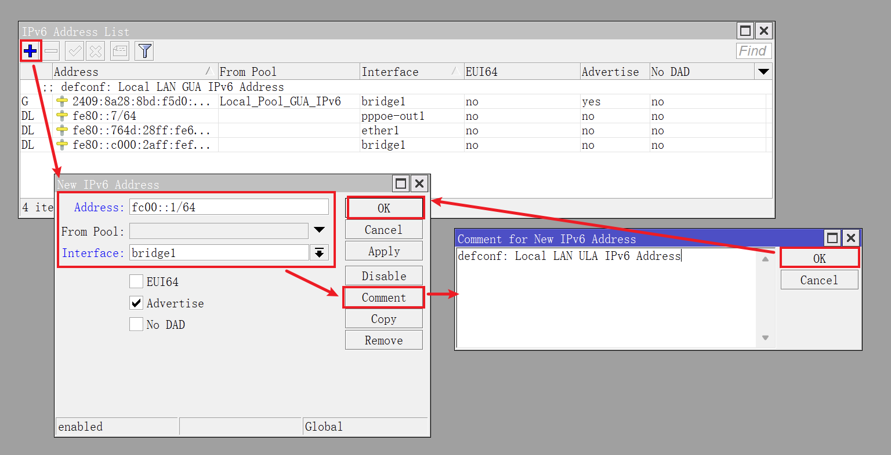

|参数|值|说明|
|--|--|--|
|Address|`fc00::1/64`|指定前缀，前缀长度为 `/64` ，并使用顺序第一个地址|
|Interface|`bridge1`|选择内部网桥接口|
|Advertise| **必须勾选** |让内网设备将生成 ULA IPv6 地址|
|Comment|`defconf: Local LAN ULA IPv6 Address`|备注信息|

`DHCPv6 Client` 正确获取 IPv6 前缀，并且内部网桥 `bridge1` 两个 IPv6 地址均添加完成后，如图所示：

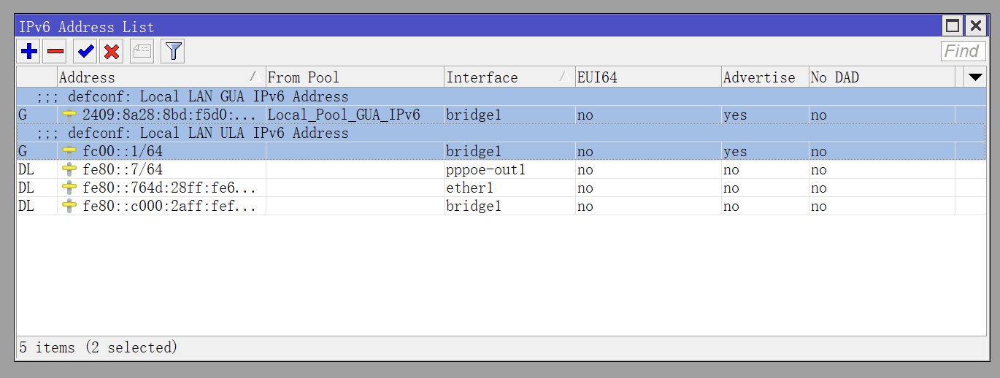

## 3.配置ND服务

### 3.1.配置ND前缀设置

点击 Winbox 左侧导航 `IPv6` 菜单的子菜单 `ND` 。  

在 `Neighbor Discovery` 对话框中切换到 `Prefixes` 选项卡，点击 `Default` 按钮：

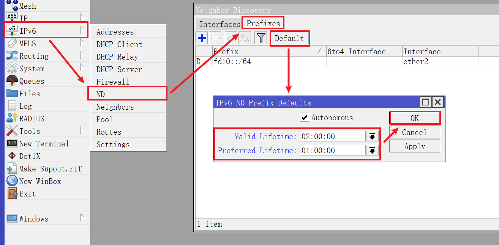

|参数|值|说明|
|--|--|--|
|Valid Lifetime|`1d 00:00:00`|IPv6 地址最大生存周期|
|Preferred Lifetime|`12:00:00`|IPv6 地址建议生存周期|

这里可以看到一个标记为 `D` 的 Prefix `fc00::/64` ，表示该条目为动态自动生成的。

### 3.2.配置ND通告

在 `Neighbor Discovery` 对话框中切换到 `Interfaces` 选项卡。  

鼠标 **单击** `Interface` 为 `all` 的条目，并将其“禁用”：

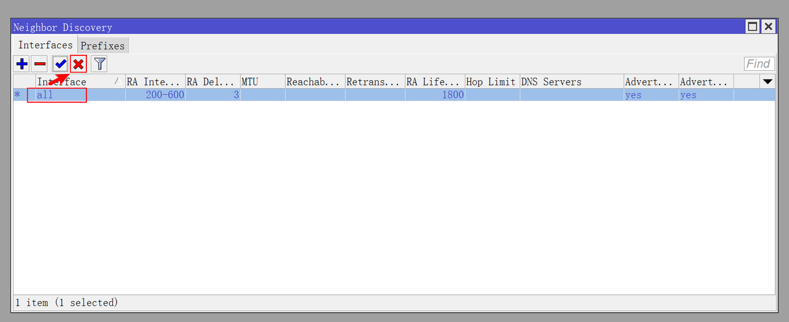

点击“添加”按钮：

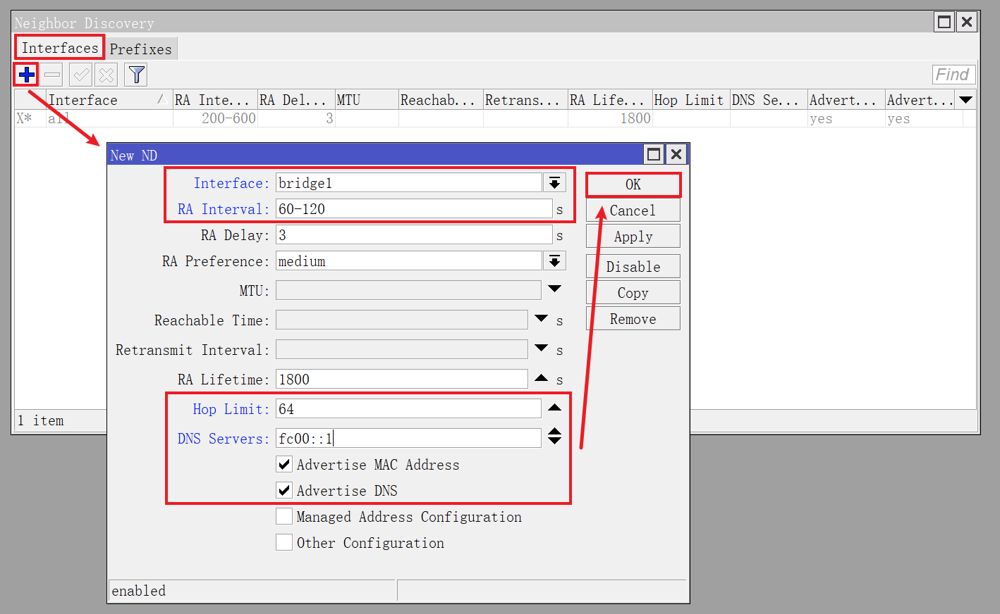

|参数|值|说明|
|--|--|--|
|Interface|`bridge1`|选择ND通告使用的接口|
|Hop Limit|`64`|缺省情况下，由设备初始发送 IPv6 单播报文的跳数限制是64|
|DNS Servers|`fc00::1`|ND 通告的 IPv6 的 DNS 服务器地址|
|Advertise MAC Address| **建议勾选** |ND 通告中将包含接口的 MAC 地址信息|
|Advertise DNS| **必须勾选** |使用 ND 设置的 DNS 服务器来通告|

如果内网环境中没有自建 DNS 服务器，则可以将 `DNS Servers` 参数设置为 `fc00::1` ，与 `bridge1` 的 ULA IPv6 地址相同。  

 **注意：**   
 **如果内网中有自建 DNS 服务器，则需要将 `DNS Servers` 参数设置为内网 DNS 服务器的 IPv6 地址。**   
 **假设内网 DNS 服务器分别为 `fc00::2` 、 `fc00::3` ，则 ND 配置如下：** 

`ND` 配置完成后，如图所示：

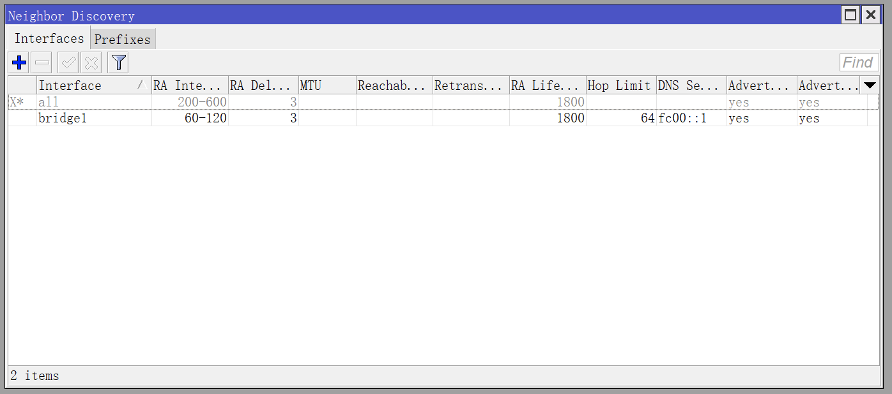

## 4.配置系统DNS

启用 IPv6 后，需要给 RouterOS 指定上游 IPv6 的 DNS 服务器地址。  

点击 Winbox 左侧导航 `IP` 菜单的子菜单 `DNS` ，并修改参数：

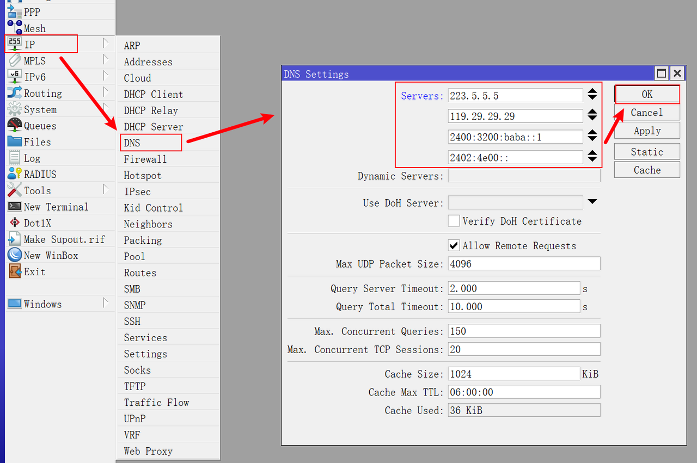

在 `Servers` 处增加国内知名的 DNS 服务提供商的 IPv6 地址。  

腾讯云 DNSPod 的 IPv6 地址为：`2402:4e00::` 和 `2402:4e00:1::` 。  

阿里云 AliDNS 的 IPv6 地址为：`2400:3200::1` 和 `2400:3200:baba::1` 。  

 **注意：**   
 **如果内网中有自建 DNS 服务器，则需要将 `Servers` 参数设置为内网 DNS 服务器的 IPv6 地址。**   
 **假设内网 DNS 服务器分别为 `fc00::2` 、 `fc00::3` ，则 DNS 配置如下：** 

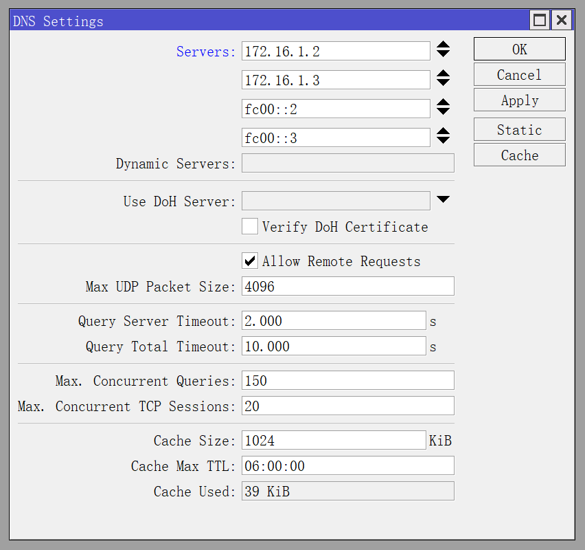

## 5.配置IPv6防火墙

与之前文章《[2.配置防火墙和流量整形](./2.配置防火墙和流量整形.md)》中类似，IPv6 的防火墙的配置同样涉及 `address-list` 、`filter` 、`nat` 、`mangle` 、`raw` 等内容。  

依然建议复制防火墙配置命令，一次性全部粘贴到终端工具中进行 “一键配置” 。  

需要注意的是，防火墙配置命令中的部分 IPv6 地址，需要根据实际情况进行调整。  

- RouterOS 的 IPv6 地址 `fc00::1`
- 内网自建 DNS 的 IPv6 地址 `fc00::2` 、 `fc00::3`

需要分别修改 `address-list` 表中的 `local_dns_ipv6` 地址参数，以及 `nat` 表中的 `DNS redirect` 部分。  

而且由于本文中内网设备只分配了 ULA IPv6 地址，因此必须使用 NAT66 的方式来访问外部 IPv6 网络，在 `nat` 表中第一条即为对应的防火墙条目。  

由于 IPv6 防火墙的配置命令很长，因此请查阅文件 [Fox_ROS_Firewall_IPv6.conf](./src/Fox_ROS_Firewall_IPv6.conf) 进行复制。  

IPv6 防火墙配置完成后，回到 Winbox，点击左侧导航 `IPv6` 菜单的子菜单 `Firewall` 并查看防火墙各个选项卡中内容：  

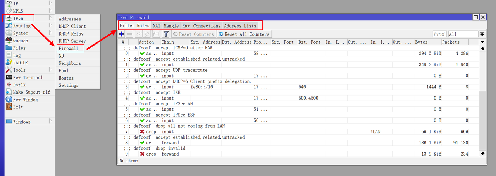

确认防火墙条目与命令中的条目一致后，便可启用 IPv6 的 `DHCPv6 Client` ，建议重启一次 RouterOS。